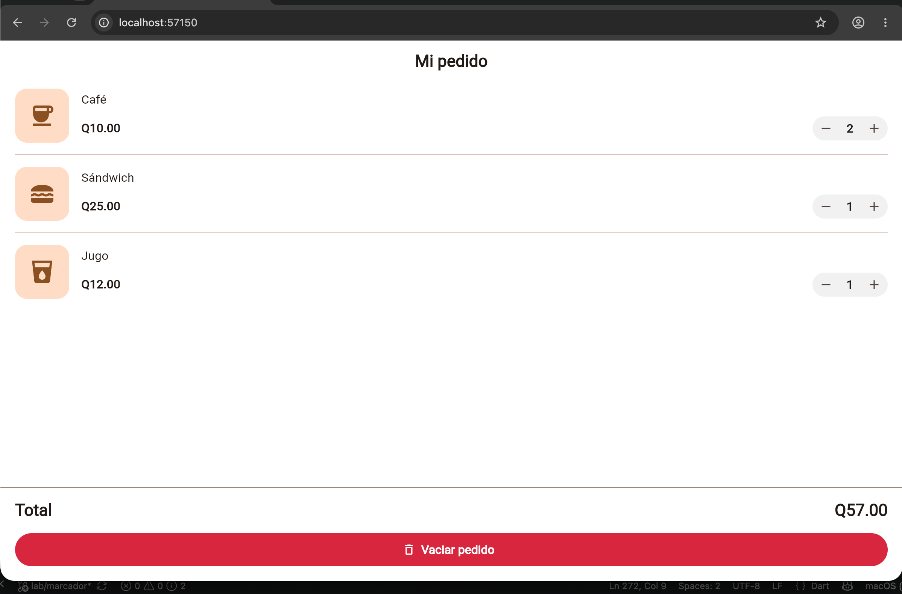

# Laboratorio: Mi pedido de cafetería

Programación de Dispositivos Móviles — Sección E

## Captura del pedido de Q57.00

2 cafés, 1 sándwich y 1 jugo:

## ¿Cómo calcula el total?

Las cantidades se guardan en una lista dentro del estado de la pantalla (`_cantidades`), en el mismo orden que los productos. El total es un getter (`_total`) que recorre los productos y suma `precio × cantidad` de cada uno. Cada vez que se presiona +1, -1 o Vaciar pedido, la cantidad cambia dentro de `setState`, la pantalla se vuelve a construir y el total se recalcula. Se muestra con `toStringAsFixed(2)` para que siempre tenga dos decimales (por ejemplo, Q57.00).

## ¿Por qué conviene reutilizar ProductoPedido?

Porque las tres filas tienen la misma estructura y solo cambian los datos. Con un solo widget se escribe el diseño una vez, las tres filas quedan iguales y cualquier cambio (un color, un espacio, un botón) se hace en un solo lugar. Además, `ProductoPedido` no guarda estado: recibe nombre, precio, cantidad y las acciones de los botones como parámetros, así que la pantalla controla las cantidades y el total, y agregar otro producto solo requiere sumarlo a la lista.