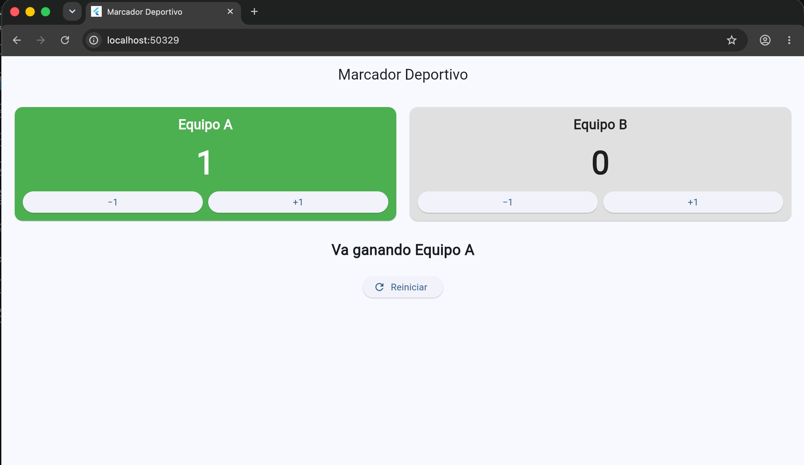
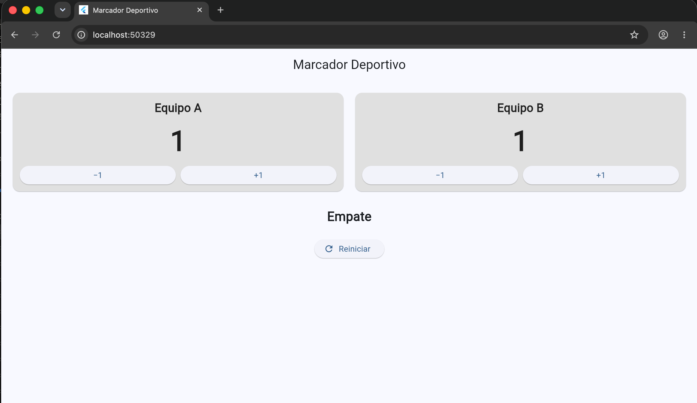

# Laboratorio: Marcador Deportivo

Aplicación Flutter que muestra el marcador de dos equipos, con botones +1 y −1, mensaje de resultado, color dinámico para el equipo que va ganando y botón de reinicio.

## Capturas

**Un equipo ganando**

**Empate**

## ¿Qué hace setState?

Cuando se presiona un botón, `setState` ejecuta el cambio de los puntos y avisa a Flutter que el estado del widget cambió. Flutter entonces vuelve a llamar a `build`, y la pantalla se redibuja con los nuevos puntos, el mensaje y los colores actualizados.

Si se cambiaran los puntos sin llamar a `setState`, la variable sí cambiaría en memoria, pero Flutter no se enteraría. La interfaz seguiría mostrando los valores anteriores hasta que algo más provocara una reconstrucción.